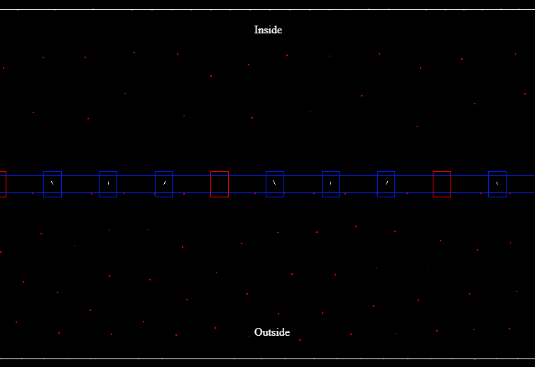

# Neural Depolarization Simulator

A real-time, interactive simulation of neural membrane depolarization using TypeScript and Three.js. This project visualizes how ion channels and membrane potentials work in neurons.



## Overview

This simulator demonstrates several key concepts in neural cell membrane dynamics:

- Ion movement across cell membranes
- Voltage-gated ion channels
- Membrane potential changes during depolarization
- Ion pumps maintaining concentration gradients

## Features

### Particle System
- Simulates ions as particles with charge interactions
- Real-time physics simulation with Coulomb forces
- Brownian motion capabilities (optional)

### Membrane Components
1. **Voltage-Gated Channels**
   - Open/close based on local electric field
   - Visualized with color changes (blue = closed, green = open)
   - Field strength indicators

2. **Ion Pumps**
   - Maintains concentration gradients
   - Creates and maintains resting potential

3. **Real-time Membrane Potential Plot**
   - Shows the ratio of ions above/below membrane
   - Scrolling time-series display
   - Updates in real-time

## Controls

- **Depolarize Button**: Forces all voltage-gated channels to open
- **Membrane Potential Graph**: Shows real-time changes in membrane potential
  - X-axis: Time (scrolling from right to left)
  - Y-axis: Membrane potential (ratio of particles above/below membrane)

## Technical Implementation

Built using:
- TypeScript for type-safe code
- Three.js for particle visualization
- HTML5 Canvas for real-time plotting
- Physics engine for particle interactions

Key classes:
- `ParticleSystem`: Main simulation engine
- `VoltageGatedChannel`: Implements voltage-sensitive gates
- `ConstantConcentration`: Maintains ion concentrations
- `Rect`: Basic geometry operations

## Getting Started

1. Clone the repository
```bash
git clone https://github.com/yourusername/neural_depolarization.git
```

2. Install dependencies
```bash
npm install
```

3. Run the development server
```bash
npm run dev
```

4. Open in browser